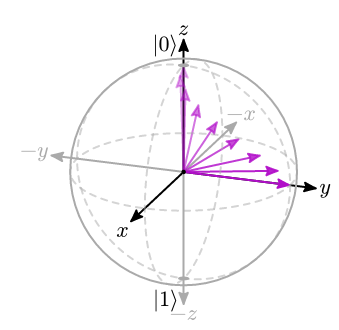

# tybloch

Draw Bloch spheres using [cetz](https://typst.app/universe/package/cetz) in Typst.

## Usage

The ``bloch-from-spherical`` function plots a single state vector at the given spherical coordinates.


```typ
#import "@preview/tybloch:0.1.0": bloch-from-spherical

#bloch-from-spherical(
    45deg,
    45deg,
    state-color: purple,
    show-projections: true,
)
```

The ``bloch-state-evolution`` functions shows the evolution between an initial state vector and a final state vector.



```typ
#import "@preview/tybloch:0.1.0": bloch-state-evolution

#bloch-state-evolution(
    (1, 0deg, 0deg),
    (1, 90deg, 90deg),
    number-of-shadows: 9,
    state-color: purple,
)
```

## Changelog

### 0.1.0

Initial release
